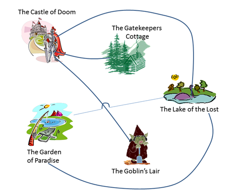
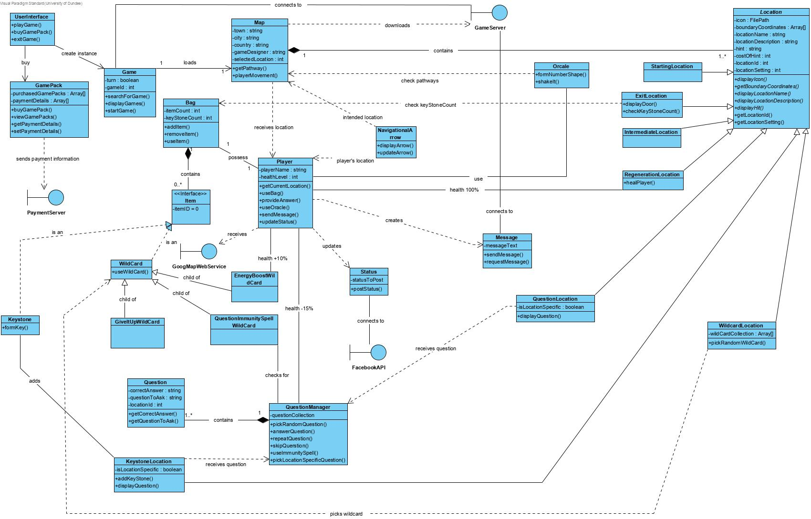

# JadeGame

## Introduction
You have been asked to specify the requirements and design for a new game under consideration by Boffin Games Ltd – Dundee’s leading developer of games which target Android devices.
The game will eventually incorporate advanced multi-player interaction but what you are being asked to design is a proof of concept demonstrator which focuses on an initial, reduced functionality version of the game. The game will target the latest version of the Android operating system (10.0) so that it can utilize the newest Android features such as gesture navigation and dark mode. The game will be developed using Google’s ‘Flutter’ development toolkit rather than Android Studio – this is because Boffin Games are shifting all of their cross-platform development to Flutter. 

## Game description
The game is called ‘JADE’. The objective of the game is to navigate a map of locations in order to find three virtual “key stones” . Each keystone will be in a different location. The player of the game doesn’t know where the keystones are, they have to find them through a process of discovery. When all key stones have been collected, the player can make their way to a final location for the game which is given the inspirational name of ‘The Exit’. Upon arriving at the Exit, the key stones will be brought together to form a key which will allow the player to unlock a door and complete the game.
The game will make use of the location features in Android to track the user’s location as they navigate the map. There are two common ways of obtaining a user’s location in Android: (i) the GPS Location Provider which is accurate but slower and consumes battery; (ii) the Network Location Provider which can be faster but dependent upon network connectivity. The ideal is to make use of a combination of these together and a ‘Fused’ Location Provider is available within the Android API for this purpose. Therefore, in the interests of preserving the user’s battery life whilst also retaining location-accuracy in the game, it is proposed that the ‘Fused’ provider should be used by the app. 

